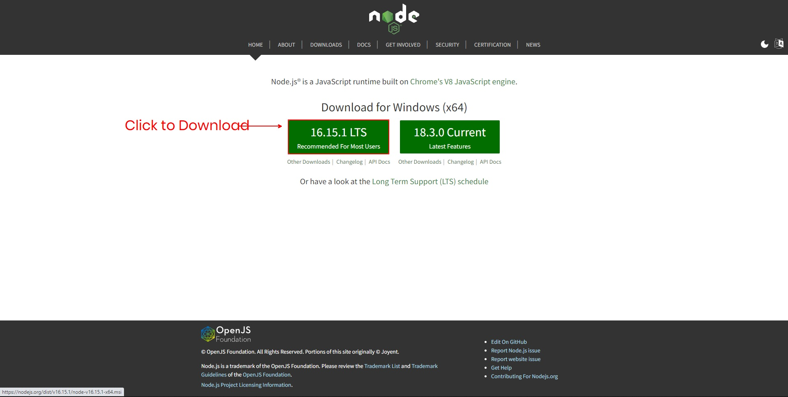
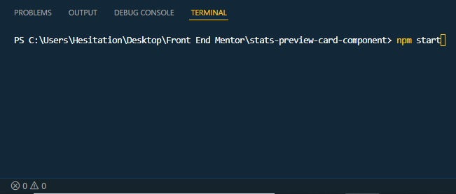
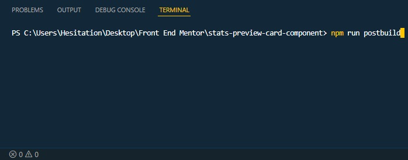
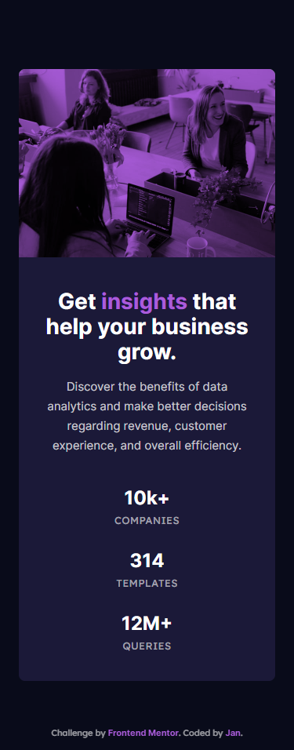
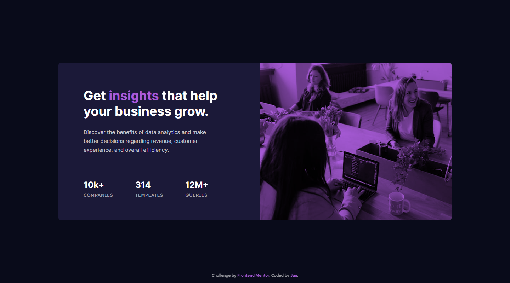

# Frontend Mentor - Stats preview card component solution

This is a solution to the [Stats preview card component challenge on Frontend Mentor](https://www.frontendmentor.io/challenges/stats-preview-card-component-8JqbgoU62). Frontend Mentor challenges help you improve your coding skills by building realistic projects.

The root directory here displays the final compiled output, to use the source files for its SASS functions, use the ```src``` folder as your root directory and requires the setup below.

## Setup

Using this requires that you install [Nodejs](https://nodejs.org/en/) to run node packet manager in the command line, if you don't have it yet download from the link above and install it. 

After that, you can now initialize the project using the command line or the build-in VScode command line using ```ctrl + ` ``` then running the ```npm install``` command. 

Then run the ```npm start``` command to start development.  

If you are finished with the project, you can also use the ```npm run postbuild``` script to have your css be run through autoprefixer for browser compatibility and minify it at the same time. 

## Table of contents

- [Overview](#overview)
  - [The challenge](#the-challenge)
  - [Screenshot](#screenshot)
  - [Links](#links)
- [My process](#my-process)
  - [Built with](#built-with)
  - [What I learned](#what-i-learned)
  - [Continued development](#continued-development)
  - [Useful resources](#useful-resources)
- [Author](#author)
- [Acknowledgments](#acknowledgments)

## Overview

### The Challenge

Users should be able to:

- View the optimal layout depending on their device's screen size

### Screenshot

|  |  |
| ------- | ------- |
| Mobile  | Desktop |

### Links

- Solution URL: [Github Repo](https://github.com/Negligence/stats-preview-card-component)
- Live Site URL: [Github Pages](https://negligence.github.io/stats-preview-card-component)

## My process

### Built with

- SASS
- [Nodejs](https://nodejs.org/en/)
- Semantic HTML5 markup
- CSS custom properties
- CSS Grid
- Mobile-first workflow

### What I learned

I put both of the images on the card as content instead of using them as CSS backgrounds so them would have inherent heights. Then I used `object-fit:cover;` in CSS to to make it span the inside of its parent container. 

```html
    <section>
      
      
      <h1>Get <span>insights</span> that help your business grow.</h1>
      <p>Discover the benefits of data analytics and make better decisions regarding revenue, customer experience, and overall efficiency.</p>

      <div class="stats">
        <figure>
          <strong>10k+</strong>
          <figcaption>companies</figcaption>
        </figure>

        <figure>
          <strong>314</strong>
          <figcaption>templates</figcaption>
        </figure>

        <figure>
          <strong>12M+</strong>
          <figcaption>queries</figcaption>
        </figure>
      </div>
    </section>
```
I used SASS to create a functions.scss file to streamline repetitive tasks like converting Pixel values to Rems and Ems, Computing clamp values for responsive resizing, as well as creating a mixin to simplify making media queries.
```scss
@use "sass:math";
@use "sass:map";
@use "sass:meta";
@use "sass:list";

// #region Colors
// Setting the colors here generates css custom properties in styles.scss
$main-bg-color: hsl(233, 47%, 7%);
$card-bg-color: hsl(244, 38%, 16%);
$accent-color: hsl(277, 64%, 61%);
$main-color: hsl(0, 0%, 100%);
$secondary-color: hsla(0, 0%, 100%, 0.75);
$tertiary-color: hsla(0, 0%, 100%, 0.6);
// #endregion Colors

// #region Typography
$primary: 'Inter', sans-serif;
$secondary: 'Lexend Deca', sans-serif;
$bold:700;
$regular:400;
// #endregion Typography

// #region Fluid Type Scale Functions

// These are the Base Stopping points for the min and max breakpoint
$media-breakpoints: (
mobile: 375px,
desktop: 1440px,
);

// Creates Default min and max breakpoint variables so we can reference them later on
$default-min-bp: map.get($media-breakpoints, "mobile");
$default-max-bp: map.get($media-breakpoints, "desktop");

// Takes in four values but has fallbacks for min and max breakpoint so you only have to worry about the min and max pixel sizes. Example usage: clamped(16px, 19px).
// If you have other breakpoints, you can manually input the min and max breakpoint as arguments. Example usage: clamped(16px, 19px, 320px, 1920px).
@function clamped($min-px, $max-px, $min-bp: $default-min-bp, $max-bp: $default-max-bp) {
  $slope: math.div($max-px - $min-px, $max-bp - $min-bp);
  $slope-vw: rnd($slope * 100, 2);
  $intercept-rems: rnd(rem($min-px - $slope * $min-bp), 2);
  
  $min-rems: rnd(rem($min-px), 2);
  $max-rems: rnd(rem($max-px), 2);
  
  @return clamp(#{$min-rems}, #{$slope-vw}vw + #{$intercept-rems}, #{$max-rems});
}

// This is just a simple rounding function to prevent very long floating point numbers
@function rnd($number, $places: 0) {
  $n: 1;
  @if $places > 0 {
    @for $i from 1 through $places {
      $n: $n * 10;
    }
  }
  @return math.div(math.round($number * $n), $n);
}
// #endregion Fluid Type Scale Functions

// #region Rem and Em Converter Functions
@function rem($px) {
  $rems: math.div($px, 16px) * 1rem;
  @return $rems;
}

$default-parent-font-size: 16px;
@function em($px, $parent-font-size: $default-parent-font-size) {
  $ems: math.div($px, $parent-font-size) * 1em;
  @return $ems;
}
// #endregion Rem and Em Converter Functions

// #region Media Query Mixins
$breakpoints-up:(
  medium: em(700px),
  large: em(900px),
  xlarge: em(1440px)
  );

  $breakpoints-down:(
  small: em(699.98px),
  medium: em(899.98px),
  large: em(1439.98px)
);

// 'if(meta.type-of($size) == string,' Checks if the $size variable is a string.
// If it is a string it will get a value from the map in 'map-get($breakpoints-up, $size),'
// If it is not a string it will take in raw pixel values and convert it to em units in 'em($size)'

@mixin mobile-media-query($size) {
  @media only screen and (min-width:
  if(meta.type-of($size) == string,
  map-get($breakpoints-up, $size), em($size))) {
    @content;
  } 
}

@mixin desktop-media-query($size) {
  @media only screen and (max-width:
  if(meta.type-of($size) == string,
  map-get($breakpoints-down, $size), em($size))) {
    @content;
  } 
}
// #endregion Media Query Mixins
```
I then called that functions.scss here in my styles.scss to use them. Although the clamped function wasn't very used here, this will become a very usefull tool for me moving forward in other projects. Learning to use SASS nesting and interpolation was very fun.
```scss
@use 'functions' as *;
@use "sass:math";
@use "sass:map";
@use "sass:list";

/* #region Defaults */
html {
  box-sizing: border-box;
  height: 100%;
  background-color: var(--main-bg-color);
  --main-bg-color: #{$main-bg-color};
  --card-bg-color: #{$card-bg-color};
  --accent-color: #{$accent-color};
  --main-color: #{$main-color};
  --secondary-color: #{$secondary-color};
  --tertiary-color: #{$tertiary-color};
  --ff-head: #{$primary};
  --ff-sub: #{$secondary};
  --fw-bold: #{$bold};
  --fw-reg: #{$regular};
}

*,*::before,*::after {
  box-sizing: inherit;
}

:not(ul, ol, li) {
  margin: 0;
  padding: 0;
  line-height: 1;
}

body {
  height: inherit;
  display: grid;
  place-items: center;
  gap: clamped(16px, 32px);
  
  main {
    display: contents;
  }
}

h1,h2,h3,h4,h5,h6,p,a,footer,figure {
  font: {
    family: var(--ff-head);
    weight: var(--fw-bold);
  }
  color: var(--main-color);
}

p, figcaption, footer {
  font-weight: var(--fw-reg);
  color: var(--secondary-color);
}

figcaption, footer {
  font-family: var(--ff-sub);
  color: var(--tertiary-color);
}

a {
  text-decoration: none;
}

footer { 
  font-size: rem(11px);
  position: fixed;
  inset: auto 0 1rem;
  text-align: center; 
  
  > a {
    color: var(--accent-color);
  }
}
/* #endregion Defaults */

/* #region Mobile Styling */
section {
  width: rem(327px);
  height: rem(780px);
  border-radius: rem(8px);
  background-color: var(--card-bg-color);
  overflow: hidden;
  display: grid;
  justify-items: center;
  grid: 
  "   img  img  img   " max-content
  "    .    .    .    " rem(40px)
  "    .    h1   .    " max-content
  "    .    .    .    " rem(16px)
  "    .    p    .    " max-content
  "    .    .    .    " rem(43px)
  "    .  stats  .    " max-content
  "    .    .    .    "
  /  auto  1fr  auto;
  transition:
  height 250ms ease-in-out,
  width 250ms ease-in-out  ;

  
  * {
    text-align: center;
  }
  
  &::before {
    grid-area: img;
    justify-self: normal;
    content: '';
    background-color: var(--accent-color);
    mix-blend-mode: multiply;
  }
  
  > img {
    grid-area: img;
    height: rem(240px);
    object-fit: cover;
  }

  > img[src*="desktop"] {
    display: none;
  }

  > h1 {
    grid-area: h1;
    width: rem(260px);
    font-size: rem(28px);
    line-height: em(32px, 28px);

    span {
      color: var(--accent-color);
    }
  }

  > p {
    grid-area: p;
    width: rem(260px);
    font-size: rem(15px);
    line-height: em(25px, 15px);
  }

  > .stats {
    grid-area: stats;
    display: grid;
    gap: rem(33px);

    figure {
      display: grid;
      gap: rem(10px);
    }

    strong {
      font-size: rem(24px);
    }
    
    figcaption {
      font-size: rem(13px);
      text-transform: uppercase;
      letter-spacing: rem(0.40px);
    }
  }
}

/* #endregion Mobile Styling */

/* #region Desktop Styling */

@include mobile-media-query(1150px) {
  section {
    width: rem(1110px);
    height: rem(446px);
    padding-inline-start: rem(71px);
    justify-items: start;
    grid: 
    "    .    .    .    img    " rem(71px)
    "    .    h1   .    img    "
    "    .    .    .    img    " rem(25px)
    "    .    p    .    img    "
    "    .    .    .    img    " rem(75px)
    "    .  stats  .    img    "
    "    .    .    .    img    "
    /   auto  1fr  auto  rem(540px);

    * {
      text-align: initial;
    }

    > img {
      width: 100%;
      height: 100%;
    }

    > img[src*="desktop"] {
      display: inline;
    }

    > img[src*="mobile"] {
      display: none;
    }

    > h1 {
      width: rem(380px);
      font-size: rem(36px);
      line-height: em(44px, 36px);
    }

    > p {
      width: rem(380px);
    }
  
    > .stats {
      grid-auto-flow: column;
      align-items: center;
      gap: rem(63px);
    }
  }
}
/* #endregion Desktop Styling */

/* #region Active states */
footer > a {
  transition: color 250ms ease-in-out;

  &:hover,
  &:focus,
  &:active {
    color: white;
  }

  &:focus,
  &:active {
    border-radius: rem(2px);
    outline:currentColor solid 2px;
  }

}
/* #endregion Active states */
```

### Continued development

These functions will be very helpful moving forward with future projects.

```clamped()```

Takes 2 arguments -- Minimum Pixel Value, Maximum Pixel Value and will compute the middle value aswell as converting them to Rem values.

```css
p {
  font-size: clamped(16px, 19px);
}
```

```css
p {
  font-size: clamp(1rem, 0.5vw + 0.88rem, 1.19rem);
}
```

```rem()```

Takes the pixel value and divides it by 16 (which is the default browser font size) then returns it in Rems.

```css
strong {
      font-size: rem(24px);
    }
```
```css
section > .stats strong {
  font-size: 1.5rem;
}
```

```em()```

Takes the pixel value and divides it by 16 (which is the default browser font size) then returns it in Ems. If its parent container has a different font size, it can take in another value to replace the default 16 that you divide by.

```css
h1 {
  line-height: em(44px, 36px);
}
```
```css
h1 {
  line-height: 1.2222222222em;
}
```

Mixins that use ```@include```

The following mixins create media queries for mobile first and desktop first approaches.
They take in a pixel values as an argument then converts it to em values.

```mobile-media-query()```

```css
@include mobile-media-query(1150px) {

}
```
```css
@media only screen and (min-width: 71.875em) {

}
```

```desktop-media-query()```

```css
@include desktop-media-query(1150px) {

}
```
```css
@media only screen and (max-width: 71.875em) {

}
```

### Useful resources

- [Fluid Type Scale Calculator](https://utopia.fyi/type/calculator), [Neko Calc Px to Rem Converter](https://nekocalc.com/px-to-rem-converter), and [Neko Calc Px to Em Converter](https://nekocalc.com/px-to-em-converter) - These are the originals that I drew inspiration from and used before when I didn't know how to use SASS.
- [Creating a Fluid Type Scale with CSS Clamp](https://www.aleksandrhovhannisyan.com/blog/fluid-type-scale-with-css-clamp/) - An article that explains how the fluid type scale calculator computes the preferred size for clamps. This is also the source that I used to create my modified _functions.scss
- [Stop using an extension to compile Sass](https://www.youtube.com/watch?v=o4cECvhrBo8) - Video that taught me how to get a simple SASS setup up and running and is the base for my modified package.json setup file.
- [Stop using @import with Sass | @use and @forward explained](https://www.youtube.com/watch?v=CR-a8upNjJ0) - Gave me a glimpse of how to connect SASS files to each other.
- [Write less code with these Sass mixins](https://www.youtube.com/watch?v=7ruDsUN4-iA) - My Main inspiration to create my on Mixins.
- [Get your stylesheets more organized with Sass partials](https://www.youtube.com/watch?v=9Ld-aOKsEDk) and [5 tips to learn Sass quickly](https://www.youtube.com/watch?v=7b_q5NV4bUc)- Taught me on how to create organized SASS folder structures, but ulmately led me to simplify my folder structure for my current project and will probably use the partials I learned here in bigger, more complex projects.
- [3 custom property tricks to improve your CSS](https://www.youtube.com/watch?v=pKWSXyilG9k) and [The one big problem with custom properties (and how to get around it)](https://www.youtube.com/watch?v=CVCHrxzNNDc) - These are the two videos that convinced me to opt for CSS custom properties over SASS variables, and in turn forced me to learn about SASS interpolation.
- [5 Sass features that make it better than vanilla CSS](https://www.youtube.com/watch?v=g1kF45K-q7o) - Gave me a brief overview of what I can do with SASS and made me try to incorporate as much functionality as I can to simplify future works.

- [Sass with auto-refresh (and more) made easy](https://www.youtube.com/watch?v=wYWf2m_yzBQ), [Sass, BEM, & Responsive Design (4 hr beginners course)](https://www.youtube.com/watch?v=jfMHA8SqUL4), [Sass @import is being replaced with @use and @forward](https://www.youtube.com/watch?v=dOnYNEXv9BM), [Generate custom props & utility classes with Sass?!](https://www.youtube.com/watch?v=gP8yFWCTr7Q) - More SASS Videos I binge-watched to further understand the fuck that I was doing.

## Author

- Frontend Mentor - [@Negligence](https://www.frontendmentor.io/profile/Negligence)
- Github - [Negligence](https://github.com/Negligence)
- Twitter - [@IEImNothing](https://twitter.com/IEImNothing)
- Twitch - [Arrogant_Negligence](https://www.twitch.tv/arrogant_negligence)
- Youtube - [Jan Panado](https://www.youtube.com/channel/UC4ojhHYmkHptu2JpyKtrL-w)
- LinkedIn - [Jan Panado](https://www.linkedin.com/in/janp-09/)
- Facebook - [Jan Panado](https://www.facebook.com/jan.panado)
- Website - [Jan Panado](https://janpanado.com/)

## Acknowledgments

Shout out to [Kevin Powell](https://www.youtube.com/kepowob) and [Coder Coder](https://www.youtube.com/c/TheCoderCoder), their videos have been a Huge **HUGE** help. I really don't know what I would've done without their resources helping me out.
